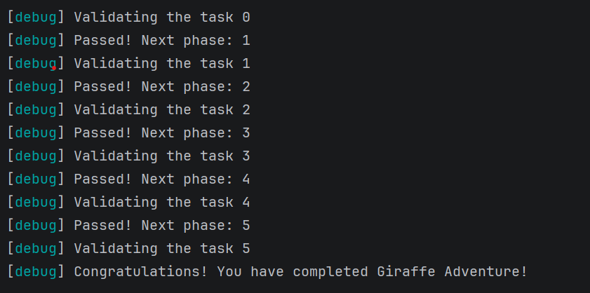

# Abstract

遊戲名稱：Counter-Strike

組員：

- 113590006 鄞永力

# Game Introduction

Counter-Strike 是一款純粹的 3D 第一人稱戰術射擊遊戲。遊戲致敬《CS》的核心射擊手感，捨棄複雜的任務目標，專注於「團隊殲滅」與「純粹槍法對決」。玩家將在精緻的 3D 封閉地圖中，體驗高強度、極短反應時間的戰鬥。遊戲支援全方位的網路多人連線，並配備強大的智慧 AI 機器人系統，確保單機玩家也能享有完整的對抗體驗。

PvE 模式:
- 遊戲設計: 自訂敵人機器人數量，並在戰場上互相廝殺並獲得積分，其中包含幾十種槍械可使用積分選購。
- 機器人設計: 希望可實現 Navigation Mesh 路徑搜尋演算法，以隨機移動為主，直到遇見玩家後主動靠近。
- 通關目標: 雙方皆有限制生命數，直至其中一方將生命數耗盡為遊戲結束。
- 預期關卡數: 1

[遊戲連結](https://www.counter-strike.net/cs2?l=tchinese)

# Development timeline

- Week 2 ＆ Week 3：3D 素材準備與場景搭建
  - [ ] 模型導入：整合 T/CT 角色與基礎場景模型
  - [ ] 物理碰撞：實作地圖障礙物與角色膠囊體的碰撞處理
  - [ ] 移動邏輯：實作第一人稱走位、跳躍，確保 3D 空間移動流暢
- Week 4 ＆ Week 5：第一人稱核心控制系統
  - [ ] 槍械系統：建立各類槍枝的基礎類別與數值設定
  - [ ] 射擊機制：實作 Raycast 射擊判定、基本的開火邏輯
  - [ ] 連線同步：建立伺服器/客戶端基礎架構，達成玩家位置與射擊動作的網路同步
- Week 6 ＆ Week 7：深度彈道系統
  - [ ] 實作 Recoil Pattern (固定後座力噴灑路徑)
  - [ ] 實作動態精準度系統（移動中、跳躍中彈道會發散）
  - [ ] 實作物件穿透（Wallbang）邏輯與傷害衰減計算
- Week 8 ＆ Week 9：智慧 AI 機器人 (Bots)
  - [ ] 建立地圖導航網格（NavMesh）與 AI 路徑尋找
  - [ ] 實作 AI 行為樹（巡邏、發現目標、掩體躲避、射擊）
  - [ ] 針對沒朋友玩家開發「單機對戰模式」與難度分級系統
- Week 10 ＆ Week 11：購買選單與經濟系統
  - [ ] 實作 Buy Menu (購買選單) 介面與快捷鍵購買邏輯
  - [ ] 實作金錢獲取機制（擊殺獎勵、回合結束獎勵）
  - [ ] 實作背部與手持武器切換系統（Slot 1, 2, 3）
- Week 12 ＆ Week 13：回合流程與地圖邏輯
  - [ ] 實作團隊殲滅勝負判定（Team Deathmatch / Elimination）
  - [ ] 實作陣營自動重生點與回合重置邏輯
  - [ ] 實作 HUD 介面（小地圖、血量、彈藥、計分板）
- Week 14 ＆ Week 15：戰鬥視覺特效 (VFX) 與回饋
  - [ ] 實作寫實彈孔貼圖（Decals）與牆面火花回饋
  - [ ] 實作擊中血跡噴濺、螢幕受擊震動與方向指示
  - [ ] 實作死亡布娃娃系統（Ragdoll）與 3D 空間腳步音效
- Week 16 ＆ Week 17：Debug 與品質控管 (QC)
  - [ ] 修復網路延遲造成的位移「回溯」與判定問題
  - [ ] 排除性能瓶頸，優化 3D 場景渲染效率
  - [ ] 進行最終平衡測試（調整槍械威力與 AI 槍法精準度）

# PTSD Girafee Adventure 通關證明

